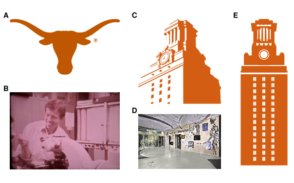
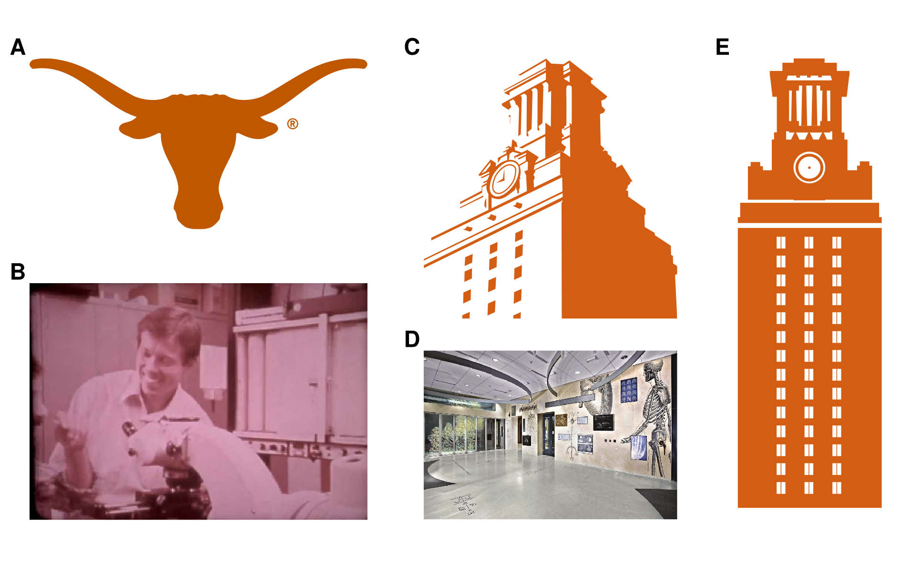
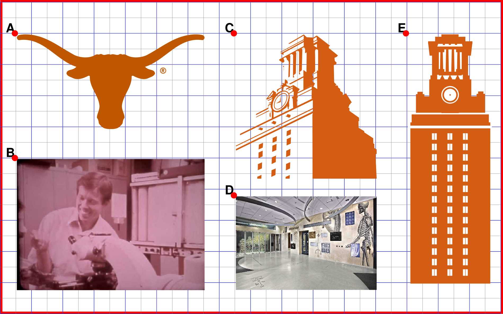

# Multipanel Figure with Tikz

This is an example of generating a multipanel figure using Tikz/Latex.

See [figures](./figures/) for more formats.

## Examples

### SVG

### PNG

#### PNG Draft

### PDF

[pdf](./figures/figure-1.pdf).

## Setup

To get started you'll need `texlive` and `inkscape`.
Optionally, I recommend `GNUmake` for tying together see the included [`Makefile`](./Makefile).

## Why?

The main benefit of this approach is visual consistency and precise alignment using entirely imperative definitions.
This approach simplifies the hassle of updating a figure in the eleventh hour prior to submission.
Simply update the underlying panel's file and run `make pdfs`.

No more pointing and clicking (or propriety software)!

## Friction

The main disadvantage of this approach is using `svg` formats which are generally preferred for simple plots.
Latex can not easily ingest these as graphics, the workaround provided here is first converting all `svg`'s into `pdf`'s.
Similarly if you require an `svg` or `png` output for use in other formats (docx/pptx/web) you can use `inkscape` for the final conversion.

## Docker?

If you prefer to use a docker container for figure generation
and don't want to need texlive and inkscape, locally open an issue
Then when I have time, I'll add a `Dockerfile` and instructions for use.
